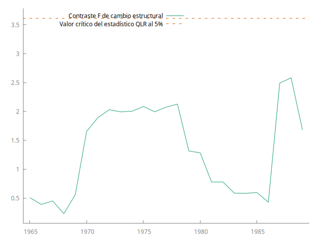

## Interpretación coeficientes $\beta$
---
- Modelo $\log - \log$:

  En este tipo de modelos $\log{(Y_i)} = \beta_1 + \beta_2 \log{(x_{i2})}+ u_i$ a $\beta_2$ se le conoce como *elasticidad* de *y* respecto a *x*, y mide el cambio porcentual de $Y_i$ respecto a un cambio porcentual de $x_{ik}.$

  **Ejemplo:** si $\beta_2 = 0.4$, un aumento del $1\%$ en $x_{ik}$ provoca un aumento del $0.4\%$ en $Y_i$.

- Modelo $\log - lineal$:
  
  Para un modelo $\log{(Y_i)} = \beta_1 + \beta_2 x_{i2} + u_i$ a $\beta_2$ se le conoce como *semielasticidad* y mide el cambio porcentual de $Y_i$ por una unidad de $x_{ik}$, es decir que para un aumento de una unidad de $x_{ik}$ cambia $Y_i$ en $100\times \beta_2 \%.$

  **Ejemplo:** si $\log{(salario)} = 1 + 0.01\ experiencia$, cada año de experiencia aumenta el salario en $1\%.$

- Modelo $lineal-\log$:
  
  Para un modelo $Y_i = \beta_1 + \beta_2 \log{(x_{i2})} + u_i$ a $\beta_2$ se le conoce como *semielasticidad* y mide el cambio por unidad absoluta en $Y_i$ por cambio porcentual de $x_{ik}$, es decir que para un aumento del $1\%$ de $x_{ik}$ cambia $Y_i$ en $ \beta_2/100$ unidades.

  **Ejemplo:** si $salario = 1 + 500\ \log{(experiencia)}$, cada $1\%$ de experiencia aumenta el salario en $5$ pesos.

## Prueba de multicolinealidad (Índice de condición)
---
Recordando que en notación matricial el MLRM se ve de la siguiente forma
$$\mathbf{Y} = \pmb{X\beta} + \mathbf{u}$$
y que el estimador de mínimos cuadrados es 
$$\pmb{\hat{\beta}} = (\pmb{X'X})^{-1} \pmb{X'Y}.$$

El índice de condición se obtiene a partir de calcular los valores propios de la matriz $\pmb{X'X}$, a partir de estos valores se deriva el *número de condición* $(k)$, el cual se define como
$$ k = \frac{\text{Valor propio máximo}}{\text{Valor propio mínimo}}$$
y el índice de condición 
$$IC = \sqrt{k}.$$

**Regla de dedo para $IC$:** Si el $IC$ es menor a $10$ no hay un problema grave de multicolinealidad, para valores entre 10 y 30, hay multicolinealidad entre moderada y fuerte, y si excede de 30, una multicolinealidad grave.

## Investigación pruebas de diagnóstico
---

### Prueba de Chow
---
La prueba de Chow nos dice si los coeficientes de una regresión son los mismos para un conjunto de datos dividido. 
Considerando el modelo general con $k$ variables explicativas y una constante, y una muestra con dos grupos: $g=1,2$.
$$ Y_{g} = \beta_{1,g} + \beta_{2,g}x_{2,g} + \dots + \beta_{k,g} x_{k,g} + u_g $$
La prueba de Chow busca probar si los coeficientes y las constantes son iguales en los dos, es decir,
$$H_0 : \beta_{1,1} = \beta_{1,2}, \beta_{2,1} = \beta_{2,2}, \dots, \beta_{k,1} = \beta_{k,2},$$
esta hipótesis incluye $k+1$ restricciones.

La prueba consiste en realizar tres estimaciones con el modelo general, una para cada grupo ($Y_1$ y $Y_2$) y la tercera para el conjunto de datos completo $(Y)$. Ya que se tienen las estimaciones, se calcula la suma de residuales cuadrados de cada uno de los modelos:
$$\begin{align*} SRC_1 &= \sum \hat{u}_1^2 \\  SRC_2 &= \sum \hat{u}_2^2 \\ SRC &= \sum \hat{u}^2 \end{align*}.$$

Ya que se tienen las sumas, se calcula el estadístico $F$ de la siguiente manera:
$$ F = \frac{\frac{(SRC - (SRC_1 + SRC_2))}{k+1} }{\frac{SRC_1 + SRC_2}{(n_1 + n_2 - 2(k+1))} } $$
donde $n_1$ y $n_2$ son el número de observaciones del grupo $1$ y del grupo $2$ respectivamente. 

Si no hay un cambio estructural, es decir, $Y_1$ y $Y_2$ son las mismas, $SCR$ y $SCR_1+SCR_2$ no deben ser estadísticamente diferentes. Por lo tanto:
$$ F \sim F_{[k+1,(n_1+n_2-2(k+1))]}. $$

De esta manera, cuando $F$ no excede el valor crítico $ F_{[k+1,(n_1+n_2-2(k+1))]} $, no se rechaza la hipótesis nula de *estabilidad paramétrica*. Caso contrario cuando $F$ es mayor que el valor crítico $ F_{[k+1,(n_1+n_2-2(k+1))]} $, se rechaza la hipótesis nula y se concluye que $Y_1$ y $Y_2$ son diferentes.

Observaciones de la prueba de Chow:
- Se generaliza fácilmente para casos de más de un cambio estructural.
- Dado que la prueba de Chow es simplemente una prueba F, sólo es válida bajo homocedasticidad. Primero se debe asegurar que las varianzas de los residuos de $Y_1$ y $Y_2$ son las mismas.
- Solo dice si las regresiones son las mismas, pero no especifica si difieren en las constantes o en los coeficientes.
- Supone que se conocen los puntos de cambio estructural.

### Prueba RV de Quandt (QLR)
---
La prueba RV de Quandt permite comprobar la existencia de cambios estructurales cuando se desconoce la fecha de ruptura. El estadístico de esta prueba es el mismo que se utiliza en la prueba de Chow $(F(\tau))$, pero en este caso se calcula para un rango de fechas de ruptura $(\tau_0 \leq \tau \leq \tau_1).$ De esta manera se tiene que:
$$ QLR = \text{max}[F(\tau_0),F(\tau_0+1),\dots,F(\tau_1)].$$ 

Observaciones de la prueba RV de Quandt:
- No se necesita conocer el punto de quiebre.
- Es pesada computacionalmente, ya que requiere estimar el modelo para cada posible punto de quiebre.

### Prueba CUSUM
---
Considerando el modelo de regresión
$$ y_t = \pmb{x_t'\beta_t}+u_t, \ t=1,\dots,T,$$
donde en el tiempo $t$, $y_t$ es la observación de la variable dependiente, $\pmb{x_t}$ es el vector columna de $k$ regresores, y $\pmb{\beta_t}$ es un vector columna de coeficientes, el cual tiene el subíndice $t$ que indica que puede cambiar con el tiempo. Además se asume que los errores $u_t$ son independientes y se distribuyen como $N(0,\sigma_t^2)$. La prueba CUSUM se basa en la hipótesis nula $H_0$ de constancia en el tiempo, es decir
$$\begin{align*} \pmb{\beta_1} = \pmb{\beta_2} &= \dots = \pmb{\beta_T} = \pmb{\beta}, \\ \sigma_1^2 = \sigma_2^2 &= \dots = \sigma_T^2 = \sigma^2. \end{align*} $$

Para llevar a cabo la prueba se calculan los residuos recursivos $w_r$ de la siguiente manera:
$$ w_r = \frac{y_r - \pmb{x_r'b_{r-1}}}{\sqrt{1 + \pmb{x_r'(X_{r-1}'X_{r-1})^{-1}x_r}}}, \ r=k+1,\dots,T,$$
donde $\pmb{X_j'}=[\pmb{x_1,\dots,x_j}]$, $\pmb{Y_j'} = [y_1,\dots,y_j]$ y $\pmb{b_j} = \pmb{(X_j'X_j)^{-1}X_j'Y_j}$ la estimación de mínimos cuadrados. Una propiedad de los residuos recursivos es que bajo $H_0$, $w_{k+1},\dots , w_{T}$ son independientes y se distribuyen como $N(0,\sigma^2)$.

Con base en lo mencionado anteriormente, si $\pmb{\beta_t}$ es constante hasta $t=\tau_0$ y a partir de ahí difiere del valor constante, entonces las $w_r$ tienen media cero hasta $r=\tau_0$, pero después, en general tendrán media distinta de cero. Por lo que se pensó en examinar graficamente el comportamiento de las medias de los valores $w_r$ respecto a cero a lo largo del tiempo.

Después de calcular los residuos recursivos $w_r$, se considera la gráfica de la cantidad cusum
$$ W_r = \frac{1}{\hat{\sigma}} \sum_{j = k+1}^{r} w_j$$,
contra $r$, para $r=k+1,\dots,T$, donde $\hat{\sigma}^2 = S_T/(T-k)$. A esta gráfica se le adicionan dos lineas rectas que crean una banda de confianza alrededor del cero para el comportamiento de $ W_r$. Las lineas estan dadas por $y(t) = d + c(t-k)$, para $t\in (k,T)$ y con $d = \pm a\sqrt{T-k}$, $c = 2a/\sqrt{T-k}$, donde a es un parámetro de la significancia.

En el gráfico obtenido, si $W_r$ permanece dentro de las lineas, los parámetros son estables, cuando $W_r$ sale de las bandas, hay evidencia de cambio estructural.

Observaciones de la prueba CUSUM:
- Su interpretación visual es sencilla.
- Detecta cambios pequeños en los parámetros.
- No se necesita especificar donde ocurre el cambio estructural.
- Si hay heterocedasticidad puede fallar crear falsos rechazos.
- Como depende de las primeras $k$ observaciones, estas pueden afectar el resultado.

### Prueba CUSUMSQ
---
Esta prueba complementa a CUSUM, y es útil especialmente cuando las $\pmb{\beta_t}$ difieren del valor constante de forma aleatoria.

Consiste en graficar las cantidades
$$s_r = \left( \sum_{j=k+1}^{r} w_j^2 \right)/\left( \sum_{j=k+1}^{T} w_j^2 \right) = S_r/S_T, \ r=k+1,\dots,T.$$
Se agregan las lineas $\pm c_0 + (r-k)/(T-k)$ para crear la banda de confianza y analizar el comportamiento de $s_r$, donde $c_0$ es un parámetro de la significancia.

Observaciones de la prueba CUSUMSQ:
- También se interpreta fácilmente.
- Detecta cambios abruptos.
- Detecta cambios en los parámetros o en la media de los errores, pero no indica donde sucede el cambio.
- Al elevar al cuadrado los residuos, los valores atípicos afectan la prueba.

### Prueba RESET de Ramsey
---
La prueba consiste en que si el modelo 
$$ Y = \beta_1 + \beta_2 x_2 + \dots + \beta_k x_k + u$$
satisface que la forma funcional esta bien especificada, entonces ninguna función no lineal de las regresoras es significativa al agregarla al modelo original. A partir de esta idea se agrega en el modelo polinomios en los valores ajustados por mínimos cuadrados.

Nosotros decidimos cuantas funciones de los valores ajustados agregar. No hay una respuesta correcta para esta pregunta, sin embargo, en muchos casos los términos cuadrados y cúbicos son de utilidad. 

Si $\hat{Y}$ es el valor ajustado, el modelo ampliado se ve de la siguiente, manera 
$$ Y_A = \beta_1 + \beta_2 x_2 + \dots + \beta_k x_k + \delta_1 \hat{Y}^2 + \delta_2 \hat{Y}^3 + \nu. $$
Esta ecuación busca probar si se han ignorado no linealidades importantes.

Se utiliza el estadístico $F$ para probar la hipótesis nula $H_0: \delta_1 = \delta_2 = 0$ en el modelo ampliado, esto se hace de la siguiente manera:
$$ F = \frac{(R_A^2 - R^2)/\text{número de regresoras nuevas}}{(1-R_A^2)/(n-\text{número de parámetros en el nuevo modelo})}$$.
Un estadístico $F$ significativo sugiere algún tipo de problema en la forma funcional.

Observaciones de la prueba RESET:
- No se necesita saber cómo está mal especificado.
- No proporciona información de cómo proceder si se rechaza el modelo.
- Necesita muestras grandes.

## Modelo consumo de gasolina
---
### Pruebas de normalidad 

Se realizaron pruebas de normalidad al residuo del modelo de consumo de gasolina, los resultados se muestran a continuación:
| Nombre de la prueba | p-valor |
| --- | :---: |
| Doornik-Hansen | 0.29021 |
| W de Shapiro-Wilk | 0.1556 |
| Lilliefors | 0.04 |
| Jarque-Bera | 0.413541 |
| Chi-cuadrado | 0.29021 |

Además de los resultados de la tabla, obtuvimos el sesgo con un valor de $-0.260777$, el exceso de curtosis con un valor de $-0.951479$ y la distribución de frecuencias del residuo.

<figure>
    
    <figcaption>FIG 1. Distribución de frecuencias del residuo.</figcaption>
</figure>

Notamos que el sesgo es cercano a cero, como esperaríamos de una distribución normal, sin embargo, el exceso de curtosis parece no ser tan cercano al valor esperado. Estos valores no nos dan la suficiente información para poder decir si el comportamiento del residuo es normal. Para eso se realizaron las pruebas de la tabla. Considerando una confianza del $ 95\% $, cuatro de las cinco pruebas realizadas nos indican que efectivamente el comportamiento del residuo es normal, ya que $p>0.05$.

De la gráfica también observamos que $E[\hat{u}]= -7.50017\times 10^{-15}$, al ser un número tan pequeño, es razonable considerar que $E[\hat{u}] \approx 0 $.

Por lo tanto concluimos que el residuo se distribuye de manera normal, con media cero.

### Pruebas de heterocedasticidad
---
Podemos observar la siguiente gráfica 

<figure>
    
    <figcaption>FIG 2. Comportamiento del residuo a lo largo del tiempo.</figcaption>
</figure>

no se observa que la amplitud del residuo se expanda o se contraiga sistemáticamente, visualmente no hay indicios de heterocedasticidad. Sin embargo, la gráfica presentada no es una prueba formal, es por eso que se realizó la **prueba de heterocedasticidad de White** y se obtuvo un valor 
$$p = 0.118337 ,$$
para una confianza del $ 95\% $, podemos concluir que no hay heterocedasticidad.

### Pruebas de autocorrelación 
---
Se realizó la **prueba LM de autocorrelación** múltiples veces, pero considerando distintos ordenes de retardo, los resultados se muestran a continuación:

| Orden de retardo | p-valor |
| --- | :--: |
| 1 | 0.00363786 |
| 10 | 0.100818 |
| 13 | 0.0763843 |
| 18 | 0.325272 |

Notamos que al considerar un solo orden de retardo, la prueba indica que existe autocorrelación para una confianza del $95\% $, sin embargo, al considerar más ordenes de retardo, los resultados indican que no se puede rechazar la hipótesis nula de que no hay autocorrelación. Con base en que tres de las cuatro pruebas coinciden, consideramos que no hay autocorrelación en el residuo.

### Pruebas de cambio estructural
---
Se realizaron varias pruebas para probar si existen cambios estructurales en los datos del modelo.

- Prueba RV de Quandt:
  De esta prueba obtenemos la gráfica 
  <figure>
    
    <figcaption>FIG 3. Gráfica de la prueba RV de Quandt.</figcaption>
  </figure>
  
  notamos que hay en muchos años el valor del estadístico $ F $ es mayor a la linea punteada roja, y se puede ver que entre $ 1970 $ y $ 1975 $ hay un máximo, esto puede indicar cambios estructurales.

  Además de la gráfica obtuvimos que "el valor máximo de $F(6, 24) = 7.10008$ corresponde a la observación $1973$" y el "Valor $p$ asintótico $= 4.80885\times 10^{-6}$", con base en lo observado en la gráfica y el valor $p$ obtenido, se puede sospechar que existen cambios estructurales.

- Prueba CUSUM:

---
## Referencias 

- Wooldridge, J. M. (2009). *Introductory Econometrics: A Modern Approach* (4a ed.). Mason, Ohio: South Western Cengage Learning.
- Gujarati, D. N. (2015). *Econometría* (5a ed.). México, D.F.: McGraw-Hill/Interamericana Editores S.A. de C.V.
- Stock, J. H., & Watson, M. W. (2020). *Introduction to Econometrics* (4a ed., Global Edition). Harlow, England: Pearson.
- Brown, R. L., Durbin, J., & Evans, J. M. (1975). *Techniques for Testing the Constancy of Regression Relationships Over Time*. Journal of the Royal Statistical Society: Series B (Methodological), 37(2), 149–163. [https://doi.org/10.1111/j.2517-6161.1975.tb01532.x](https://doi.org/10.1111/j.2517-6161.1975.tb01532.x)