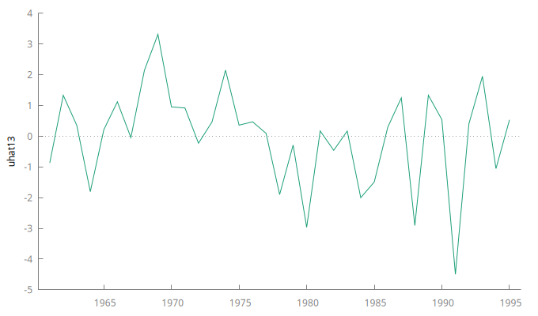

## Análisis de Residuos 
---

- **Histograma de frecuencias relativas**

  
  
  Podemos observar que el p-valor de la prueba $\chi^2$ es $p = 0.1669$, sin importar si consideramos una confianza de $90\%, \ 95\%$ o $99\%$, no podemos rechazar la hipótesis nula de que el residuo tienen una distribución normal. Además, la curva normal con la que se compara la distribución del residuo tiene una media $\mu = -7.105\times 10^{-16}$, al ser un valor muy pequeño podríamos considerarlo como cero.

- **Gráfica de los residuos**

  

  Lo primero que notamos es que no se aprecia alguna tendencia, también se observa que el residuo oscila alrededor del cero, esto da indicios de media constante, y por último, no se observa que la amplitud del residuo se expanda o contraiga, es decir, no hay indicios de heterocedasticidad. Con base en la información visual que nos proporciona la gráfica, consideramos que el residuo es estacionario.

- **Sesgo y curtosis**

  Se obtuvo un sesgo de $-0.688357$ y un exceso de curtosis de $0.712426$, esto indica que hay asimetría izquierda. En ambos casos se espera valores cercanos a cero. Los valores obtenidos son menores a uno en valor absoluto, por lo que podemos considerar que son cercanos a lo esperado.

- **Pruebas de normalidad**
  
  Se realizaron las pruebas de normalidad al residuo, los resultados se muestran en la siguiente tabla:
  
  | Nombre de la prueba | p-valor |
  | --- | :---: |
  | Doornik-Hansen | 0.166905 |
  | W de Shapiro-Wilk | 0.130684 |
  | Lilliefors | 0.04 |
  | Jarque-Bera | 0.173408 |
  | Chi-cuadrado | 0.166905 |

  al $ 95\% $ de confianza, cuatro de las cinco pruebas indican que el residuo es normal, ya que $ p>0.05 $, por lo tanto concluimos que el residuo es normal.

---

### Investigación de pruebas
---

### Prueba de White
---
La prueba se basa en que el supuesto de homocedasticidad $Var[u_i] = \sigma^2$, puede ser sustituido por el supuesto de que $u_i^2$ no esta correlacionado con ninguna de las variables ($x_{ik}$), tampoco con los cuadrados de las variables ($x_{ik}^2$), ni con ninguno de los productos cruzados ($x_{ik}x_{il}$ con $k\neq l$). 

Considerando un modelo con $k = 3$ variables independientes
$$Y_i=\beta_1+\beta_2x_{i2}+\beta_3x_{i3}+u_i,$$
la prueba de White consiste en estimar 
$$\hat{u_i}^2 = \delta_1 + \delta_2x_{i2} + \delta_3x_{i3} +\delta_4x_{i4} + \delta_5x_{i2}^2 +\delta_6x_{i3}^2 + \delta_7x_{i4}^2 + \delta_8x_{i2}x_{i3} + \delta_9x_{i2}x_{i4} + \delta_10x_{i3}x_{i4} + \nu_i,$$
después se obtiene el valor $R_{\hat{u_i}^2}^2$ para formar el estadístico 
$$LM = nR_{\hat{u_i}^2}^2, \ n \text{ el tamaño de la muestra,}$$ 
el cual sigue asintóticamente la distribución $\chi^2$ con $k$ grados de libertad. A partir de esto se calcula el valor-p.

- Si $H_0$ es cierta, entonces todos los parámetros $\delta_i$ deben ser cero (excepto la constante).
  $$H_0: \delta_2 = \delta_3 = \dots = \delta_k =0$$

Observaciones sobre la prueba de White:

- La prueba usualmente requiere de una muestra grande, especialmente si el modelo tiene muchas variables independientes. Debido a los cuadrados y los productos cruzados.
- La prueba de White puede ser una prueba de heterocedasticidad (pura), de error de especificación o de ambos.
- No sirve para identificar las variables que causan heterocedasticidad.
- Detecta cualquier tipo de heterocedasticidad.

### Prueba de White (solo cuadrados)
---
Esta es una prueba más fácil de realizar, es una versión simplificada de la prueba de White. Consiste en estimar 
$$\hat{u_i}^2 = \delta_1 + \delta_2x_{i2} + \delta_3x_{i3} +\delta_4x_{i4} + \delta_5x_{i2}^2 +\delta_6x_{i3}^2 + \delta_7x_{i4}^2 + \nu_i,$$.
en este caso se omiten los términos de productos cruzados.

Se vuelve a utilizar el estadístico $LM$ para probar $H_0: \delta_2 =\delta_3= \dots =0$

Observaciones sobre la prueba de White (solo cuadrados):
- Notamos que en este caso tenemos menos grados de libertad en la regresión auxiliar, por lo que no es necesario tener una muestra grande como en la prueba de White usual. 
- Esta se considera como una prueba de heterocedasticidad pura.
- No se necesitan muestras tan grandes.

### Prueba Breusch-Pagan
---
Para esta prueba se parte del MLRM
$$Y_i = \beta_1 + \beta_2x_{i2} + \dots + \beta_k x_{ik} + u_i,$$
después se lleva a cabo la estimación 
$$\hat{u_i}^2 = \delta_1+\delta_2x_{i2} + \dots + \delta_k x_{ik} + \nu_i$$
y se prueba la significancia de los coeficientes de la regresión utilizando los estadísticos $F$ o $LM$.

Observaciones sobre la prueba de Breusch-Pagan:
- Permite identificar la o las variables que causan heterocedasticidad.
- Asume heterocedasticidad lineal, por lo tanto no es tan general como White.

---
## Referencias

- Wooldridge, J. M. (2009). *Introductory Econometrics: A Modern Approach* (4a ed.). Mason, Ohio: South Western Cengage Learning.
- Gujarati, D. N. (2015). *Econometría* (5a ed.). México, D.F.: McGraw-Hill/Interamericana Editores S.A. de C.V.

